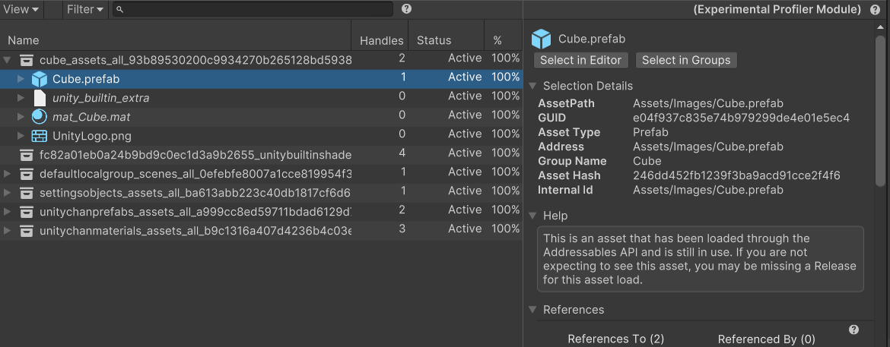
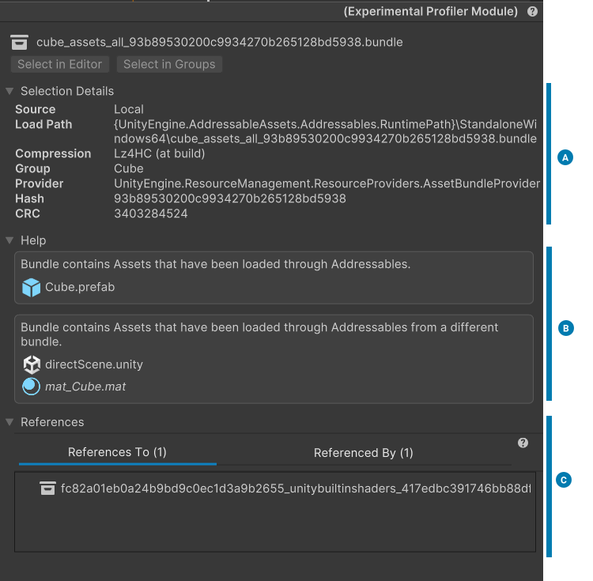

# Addressables Profiler module

The Addressables Profiler is a Unity Editor Profiler module that you can use to find out what content is loaded from Addressables.

## Prerequisites

* Basic Profiler usage supported from Unity 2021 or newer. To view detailed Profiler information 2022.2 or newer is required. All information in this documentation is for editor version 2022.2.
* [Build Reports](BuildLayoutReport.md) must be enabled and the runtime being profiled requires a build report. To enable build reports, go to the Editor preferences, select the [Addressables preferences](addressables-preferences.md), then enable **Debug Build Layout**.
* Collecting information about the running content requires build time data collection information for the debug build layout. These files are stored in the folder `<Project Directory>/Library/com.unity.addressables/buildReports`. Each build you make creates a new build report file in this directory. When running the Profiler, any incoming Profiler data from the Profiler target is synced and looks for the build report file for that runtime in the `buildReports` folder. If the build report doesn't exist, such as if the project was built using a different machine, then the Profiler doesn't display the information for that data. Select **Find in file system** to opens a file select window, which can you can use to locate a build report file on disk elsewhere.
* The Unity Profiling Core API package is required for the Profiler to run. To install this package either install through the Package Manager or though the Addressables preferences window when enabling **Debug Build Layout**.
* The Profiler module doesn't support the Play Mode Scripts **Use Asset Database (Fastest)**. The content must be built and using **Use Existing Build** based Play Mode Scripts.

## Open the Profiler module

To open the Addressables Profiler:

1. Open the Profiler window (__Window__ > __Analysis__ > __Profiler__). 
1. In the top right of the Profiler window select the dropdown button labeled __Profiler Modules__. 
1. Enable the option named __Addressable Assets__.

## View the module

The module view can be used to observe how many AssetBundles, assets, scenes, and catalogs are loaded at the frame in time.

The following screenshot displays three assets and one Scene, from one catalog, and six AssetBundles:

When you select a frame, the detail pane fills with information for that frame and displays a tree view for the loaded content.

To change what content is displayed, select the detail pane toolbar dropdown button **View**. It has the following options:

* __Groups__: Include groups in the tree view.
* __Asset Bundles__: Include AssetBundles in the tree view.
* __Assets__: Include assets in the tree view.
* __Objects__: Include the objects that are loaded within an asset.
* __Assets not loaded__: Display assets that are within a loaded bundle, but not actively loaded.

The details pane has two regions. On the left side is the Tree View of the content, which displays loaded content and you can expand to display in depth content. On the right side is the Details Inspector, which displays detailed information for the content selected from the Tree View.

## Content Tree View

You can enable or disable the Tree View columns based on your preferences. Context click on the Tree View header to display a list of the available columns.

Each column displays information depending on the content in the row:

|**Column**|**Description**|
|---|---|
| __Name__|Depending on the type, displays either:  - The Group name -AssetBundle file name - The address of the asset, or the asset path if the address isn't used - Object name, or asset type for scenes.
|__Type__| The type of the asset or object.|
|__Handles__| Number of Addressables handles that actively hold onto the content. This is often referred to as Reference Count. During loading there is an additional handle to the content.|
|__Status__| The state of the content at the time, which can be:  - __Queued__: An AssetBundle is in the download queue. - __Downloading__: An AssetBundle is being downloaded. - __Loading__: The content is being loaded in the background. - __Active__: The content is loaded and in use. - __Released__: The content has been released and there are no more active handles to the content, but might still be in memory. Refer to [Memory management](MemoryManagement.md) for more information.|
|__%__|  If the **Status** is **Downloading** or **Loading**, this displays the percentage progress of the download or load operation.|
|__Source__| Displays where the AssetBundle was loaded from:  - __Local__: Loaded from a local file on disk. - __Cache__: Previously downloaded and cached to disk, and loading was from the cached file. - __Download__: The AssetBundle hadn't been cached and needed to be downloaded.|
|__Refs By__| Number of elements that reference this content.|
|__Refs To__| Number of elements that this content references.|

### Released assets

When content is released from Addressables it might still be in memory until all content from the AssetBundle is released, and any other AssetBundle that has a dependency on any asset within the AssetBundle is also released.

Released content is indicated by a faded, or grayed out font color in the Content Tree view. Refer to [Memory management](MemoryManagement.md) for more information on how Addressables manages memory.

### Filter content

You can use the search bar in the details pane to filter the content name. You can use search filter syntax to find other content:

* __Handles__: `h`
* __Type__: `assetType`, `t`
* __Status__: `s`
* __RefsTo__: `rt`, `r`
* __RefsBy__: `rb`, `p`
* __Source__: `bundlesource`, `bs`, `b`

Filter syntax is `<tag>:<evaluation>`, where the field is a numerical field, for example `handles:3`. The default equality is `=`. You can change the equality to greater than `>` or less than `<` by including the symbol before the number, for example `Handles:>2`.

You can either use the column name without a space, or with the shorthand tag to filter.

You can also use the type filter to filter by inclusion type. Use `explicit` where an asset is explicitly included in a group through Addressables, or `implicit`, where the asset was included in the AssetBundle because another included references to it. For example, `type:explicit`.

## Inspect content details

When you select content from the Addressables Profiler module, the Inspector displays detailed information about the content, as follows: 

 _Selected content in the Inspector_

|**Section**|**Description**|
|---|---|
|**Selection Details** (A)| Contains detailed information, including the source, load path, compression, and group of the asset.|
|**Help** (B)| Contains information including any hints for any settings that might not be intended.|
|**References** (C)|Contains information about references to and from other AssetBundles.|
