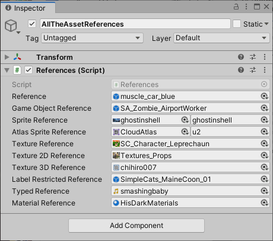

# Asset reference introduction

An [`AssetReference`](xref:UnityEngine.AddressableAssets.AssetReference) is a type that can reference an Addressable asset.

Use the `AssetReference` class in a `MonoBehaviour` or `ScriptableObject`. When you add a serializable `AssetReference` field to one of these classes, you can assign a value to the field in an Inspector window. You can restrict the assets that can be assigned to a field by type and by label. 

 *An Inspector window displaying several AssetReference fields*

To assign a value, drag an asset to the field or select the object picker icon to open a dialog that lets you choose an Addressable asset.

If you drag a non-Addressable asset to an `AssetReference` field, the system automatically makes the asset Addressable and adds it to your default Addressables group. Sprite and SpriteAtlas assets can have sub-objects. AssetReferences assigned these types of asset display an additional object picker that you can use to specify which sub-object to reference.

For examples of using `AssetReference` types in a project refer to the [Basic AssetReference](https://github.com/Unity-Technologies/Addressables-Sample/tree/master/Basic/Basic%20AssetReference), [Component Reference](https://github.com/Unity-Technologies/Addressables-Sample/tree/master/Basic/ComponentReference), and [Sprite Land](https://github.com/Unity-Technologies/Addressables-Sample/tree/master/Basic/Sprite%20Land) projects in the [Addressables-Sample](https://github.com/Unity-Technologies/Addressables-Sample) repository.

> [!IMPORTANT]
> To be able to assign assets from a group to an AssetReference field, you must enable the __Include GUIDs in Catalog__ property in the group’s Advanced Options. The __Include GUIDs in Catalog__ option is enabled by default. For more information, refer to [Content Packing & Loading schema reference](ContentPackingAndLoadingSchema.md).

## AssetReference types

The Addressables API provides [`AssetReference`](xref:UnityEngine.AddressableAssets.AssetReference) subclasses for common types of assets. You can use the generic subclass, [`AssetReferenceT<TObject>`](xref:UnityEngine.AddressableAssets.AssetReferenceT`1), to restrict an AssetReference field to other asset types.

The types of AssetReference include:

|**AssetReference type**|**Description**|
|---|---|
|[`AssetReference`](xref:UnityEngine.AddressableAssets.AssetReference)| Can reference any asset type|
|[`AssetReferenceT<TObject>`](xref:UnityEngine.AddressableAssets.AssetReferenceT`1)| Can reference assets that are the same type as `TObject`|
|[`AssetReferenceTexture`](xref:UnityEngine.AddressableAssets.AssetReferenceTexture)| Can reference a `Texture` asset.|
|[`AssetReferenceTexture2D`](xref:UnityEngine.AddressableAssets.AssetReferenceTexture2D)| Can reference a `Texture2D` asset.|
|[`AssetReferenceTexture3D`](xref:UnityEngine.AddressableAssets.AssetReferenceTexture3D)| Can reference a `Texture3D` asset.|
|[`AssetReferenceGameObject`](xref:UnityEngine.AddressableAssets.AssetReferenceGameObject)| Can reference a `Prefab` asset.|
|[`AssetReferenceAtlasedSprite`](xref:UnityEngine.AddressableAssets.AssetReferenceAtlasedSprite)| Can reference a `SpriteAtlas` asset.|
|[`AssetReferenceSprite`](xref:UnityEngine.AddressableAssets.AssetReferenceSprite)| Can reference a single `Sprite` asset.|

> [!NOTE]
> If you want to use a [`CustomPropertyDrawer`](xref:editor-PropertyDrawers) with a generic `AssetReferenceT`, or are using a version of Unity earlier than 2020.1, you must make a concrete subclass to support custom `AssetReference` types.
